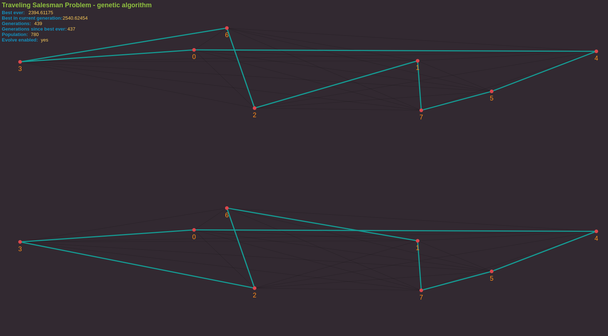

# P5.js Coding Challenges

This repository contains some coding challenges where the visual part was done using [P5.js](https://p5js.org). Inspired by https://www.youtube.com/user/shiffman/videos.

## Bubblesort's visualization

On each page load and after the execution is finished, the site will choose random data from some distribution, maybe shuffle it, then it will choose some basis color to color the bars, the smaller ones are colored differently.

One parameter can be set via query params:

* `fr`: framerate, changes the sorting animation's speed. 30 is the default value.

## Genetic Algorithm on the Traveling Salesman Problem

Some parameters can be set via query params.

* `cities`: the number of cities to visit;
* `seed`: the seed for the random number generator - it will affect the position of the cities on the map
* `pop`: the top population used on the solving of the problem

